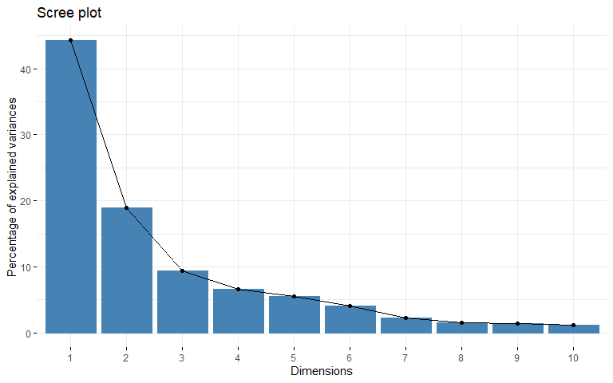
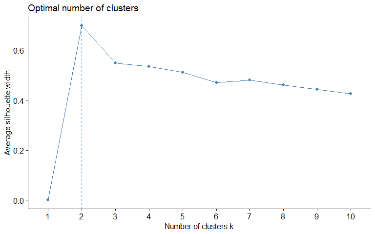
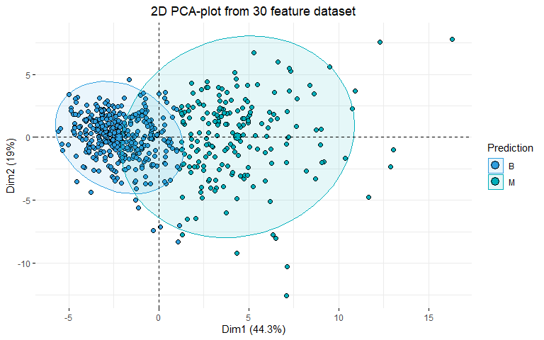

<style>
body {
text-align: justify}
</style>


<<<<<<< HEAD


=======
>>>>>>> 1f6d31a32688402336bcb1620a82c4c2a48cc117

# Problem

Construct a classifier that predicts whether the tumor is malignant (M), or benign (B) using methods of unsupervised learning and data from accompanying file data.csv. It is known there are more benign observations.

Features are computed from a digitized image of a fine needle aspirate (FNA) of a breast mass. They describe characteristics of the cell nuclei present in the image.

# Data

data.csv is a database containing data on 569 breast masses. The database contains the following information:


\begin{tabular}{l|l|l}
\hline
1 & id & observation identification label\\
\hline
2 & radius & mean of distances from center to points on the perimeter\\
\hline
3 & texture & standard deviation of gray-scale values\\
\hline
4 & perimeter & perimeter of the mass\\
\hline
5 & area & area of the mass\\
\hline
6 & smoothness & local variation in radius lengths\\
\hline
7 & compactness & \$\textbackslash{}dfrac\{perimeter\textasciicircum{}2\}\{area\} - 1\$\\
\hline
8 & concavity & severity of concave portions of the contour\\
\hline
9 & concave points & number of concave portions of the contour\\
\hline
10 & symmetry & symmetry of the mass\\
\hline
12 & fractal dimension & "coastline approximation" - 1\\
\hline
\end{tabular}

<table class="table" style="margin-left: auto; margin-right: auto;">
<tbody>
  <tr>
   <td style="text-align:left;"> 1 </td>
   <td style="text-align:left;"> id </td>
   <td style="text-align:left;"> observation identification label </td>
  </tr>
  <tr>
   <td style="text-align:left;"> 2 </td>
   <td style="text-align:left;"> radius </td>
   <td style="text-align:left;"> mean of distances from center to points on the perimeter </td>
  </tr>
  <tr>
   <td style="text-align:left;"> 3 </td>
   <td style="text-align:left;"> texture </td>
   <td style="text-align:left;"> standard deviation of gray-scale values </td>
  </tr>
  <tr>
   <td style="text-align:left;"> 4 </td>
   <td style="text-align:left;"> perimeter </td>
   <td style="text-align:left;"> perimeter of the mass </td>
  </tr>
  <tr>
   <td style="text-align:left;"> 5 </td>
   <td style="text-align:left;"> area </td>
   <td style="text-align:left;"> area of the mass </td>
  </tr>
  <tr>
   <td style="text-align:left;"> 6 </td>
   <td style="text-align:left;"> smoothness </td>
   <td style="text-align:left;"> local variation in radius lengths </td>
  </tr>
  <tr>
   <td style="text-align:left;"> 7 </td>
   <td style="text-align:left;"> compactness </td>
   <td style="text-align:left;"> $\dfrac{perimeter^2}{area} - 1$ </td>
  </tr>
  <tr>
   <td style="text-align:left;"> 8 </td>
   <td style="text-align:left;"> concavity </td>
   <td style="text-align:left;"> severity of concave portions of the contour </td>
  </tr>
  <tr>
   <td style="text-align:left;"> 9 </td>
   <td style="text-align:left;"> concave points </td>
   <td style="text-align:left;"> number of concave portions of the contour </td>
  </tr>
  <tr>
   <td style="text-align:left;"> 10 </td>
   <td style="text-align:left;"> symmetry </td>
   <td style="text-align:left;"> symmetry of the mass </td>
  </tr>
  <tr>
   <td style="text-align:left;"> 12 </td>
   <td style="text-align:left;"> fractal dimension </td>
   <td style="text-align:left;"> "coastline approximation" - 1 </td>
  </tr>
</tbody>
</table>

# One possible solution


```r
data <- read.csv("data.csv") #loading the data
id <- data$id # saving the id column, since we need it for the result data frame
data <- data[, -c(1)] #removing the id column from our data
summary(data)
```

```
##   radius_mean      texture_mean   perimeter_mean     area_mean     
##  Min.   : 6.981   Min.   : 9.71   Min.   : 43.79   Min.   : 143.5  
##  1st Qu.:11.700   1st Qu.:16.17   1st Qu.: 75.17   1st Qu.: 420.3  
##  Median :13.370   Median :18.84   Median : 86.24   Median : 551.1  
##  Mean   :14.127   Mean   :19.29   Mean   : 91.97   Mean   : 654.9  
##  3rd Qu.:15.780   3rd Qu.:21.80   3rd Qu.:104.10   3rd Qu.: 782.7  
##  Max.   :28.110   Max.   :39.28   Max.   :188.50   Max.   :2501.0  
##  smoothness_mean   compactness_mean  concavity_mean    concave.points_mean
##  Min.   :0.05263   Min.   :0.01938   Min.   :0.00000   Min.   :0.00000    
##  1st Qu.:0.08637   1st Qu.:0.06492   1st Qu.:0.02956   1st Qu.:0.02031    
##  Median :0.09587   Median :0.09263   Median :0.06154   Median :0.03350    
##  Mean   :0.09636   Mean   :0.10434   Mean   :0.08880   Mean   :0.04892    
##  3rd Qu.:0.10530   3rd Qu.:0.13040   3rd Qu.:0.13070   3rd Qu.:0.07400    
##  Max.   :0.16340   Max.   :0.34540   Max.   :0.42680   Max.   :0.20120    
##  symmetry_mean    fractal_dimension_mean   radius_se        texture_se    
##  Min.   :0.1060   Min.   :0.04996        Min.   :0.1115   Min.   :0.3602  
##  1st Qu.:0.1619   1st Qu.:0.05770        1st Qu.:0.2324   1st Qu.:0.8339  
##  Median :0.1792   Median :0.06154        Median :0.3242   Median :1.1080  
##  Mean   :0.1812   Mean   :0.06280        Mean   :0.4052   Mean   :1.2169  
##  3rd Qu.:0.1957   3rd Qu.:0.06612        3rd Qu.:0.4789   3rd Qu.:1.4740  
##  Max.   :0.3040   Max.   :0.09744        Max.   :2.8730   Max.   :4.8850  
##   perimeter_se       area_se        smoothness_se      compactness_se    
##  Min.   : 0.757   Min.   :  6.802   Min.   :0.001713   Min.   :0.002252  
##  1st Qu.: 1.606   1st Qu.: 17.850   1st Qu.:0.005169   1st Qu.:0.013080  
##  Median : 2.287   Median : 24.530   Median :0.006380   Median :0.020450  
##  Mean   : 2.866   Mean   : 40.337   Mean   :0.007041   Mean   :0.025478  
##  3rd Qu.: 3.357   3rd Qu.: 45.190   3rd Qu.:0.008146   3rd Qu.:0.032450  
##  Max.   :21.980   Max.   :542.200   Max.   :0.031130   Max.   :0.135400  
##   concavity_se     concave.points_se   symmetry_se       fractal_dimension_se
##  Min.   :0.00000   Min.   :0.000000   Min.   :0.007882   Min.   :0.0008948   
##  1st Qu.:0.01509   1st Qu.:0.007638   1st Qu.:0.015160   1st Qu.:0.0022480   
##  Median :0.02589   Median :0.010930   Median :0.018730   Median :0.0031870   
##  Mean   :0.03189   Mean   :0.011796   Mean   :0.020542   Mean   :0.0037949   
##  3rd Qu.:0.04205   3rd Qu.:0.014710   3rd Qu.:0.023480   3rd Qu.:0.0045580   
##  Max.   :0.39600   Max.   :0.052790   Max.   :0.078950   Max.   :0.0298400   
##   radius_worst   texture_worst   perimeter_worst    area_worst    
##  Min.   : 7.93   Min.   :12.02   Min.   : 50.41   Min.   : 185.2  
##  1st Qu.:13.01   1st Qu.:21.08   1st Qu.: 84.11   1st Qu.: 515.3  
##  Median :14.97   Median :25.41   Median : 97.66   Median : 686.5  
##  Mean   :16.27   Mean   :25.68   Mean   :107.26   Mean   : 880.6  
##  3rd Qu.:18.79   3rd Qu.:29.72   3rd Qu.:125.40   3rd Qu.:1084.0  
##  Max.   :36.04   Max.   :49.54   Max.   :251.20   Max.   :4254.0  
##  smoothness_worst  compactness_worst concavity_worst  concave.points_worst
##  Min.   :0.07117   Min.   :0.02729   Min.   :0.0000   Min.   :0.00000     
##  1st Qu.:0.11660   1st Qu.:0.14720   1st Qu.:0.1145   1st Qu.:0.06493     
##  Median :0.13130   Median :0.21190   Median :0.2267   Median :0.09993     
##  Mean   :0.13237   Mean   :0.25427   Mean   :0.2722   Mean   :0.11461     
##  3rd Qu.:0.14600   3rd Qu.:0.33910   3rd Qu.:0.3829   3rd Qu.:0.16140     
##  Max.   :0.22260   Max.   :1.05800   Max.   :1.2520   Max.   :0.29100     
##  symmetry_worst   fractal_dimension_worst
##  Min.   :0.1565   Min.   :0.05504        
##  1st Qu.:0.2504   1st Qu.:0.07146        
##  Median :0.2822   Median :0.08004        
##  Mean   :0.2901   Mean   :0.08395        
##  3rd Qu.:0.3179   3rd Qu.:0.09208        
##  Max.   :0.6638   Max.   :0.20750
```

```r
set.seed(123)
# our data need to be scaled, especially for the PCA algorithm
data.scaled <- as.data.frame(scale(data))
```


## Principal Component Analysis (PCA)

PCA is the algorithm for dimension-reduction. It returns linear transformation of our data in such way that the most variance is preserved in less predictors.
It needs to be performed on scaled data!


```r
library(factoextra) # used for pretty plots
```

```
## Loading required package: ggplot2
```

```
## Welcome! Want to learn more? See two factoextra-related books at https://goo.gl/ve3WBa
```

```r
pc <- princomp(data.scaled) # pca model
summary(pc)
```

```
## Importance of components:
##                           Comp.1    Comp.2     Comp.3     Comp.4     Comp.5
## Standard deviation     3.6411901 2.3835587 1.67719901 1.40611506 1.28290021
## Proportion of Variance 0.4427203 0.1897118 0.09393163 0.06602135 0.05495768
## Cumulative Proportion  0.4427203 0.6324321 0.72636371 0.79238506 0.84734274
##                            Comp.6     Comp.7     Comp.8     Comp.9    Comp.10
## Standard deviation     1.09783183 0.82099539 0.68976771 0.64510630 0.59167316
## Proportion of Variance 0.04024522 0.02250734 0.01588724 0.01389649 0.01168978
## Cumulative Proportion  0.88758796 0.91009530 0.92598254 0.93987903 0.95156881
##                           Comp.11     Comp.12    Comp.13     Comp.14
## Standard deviation     0.54166332 0.510590234 0.49084959 0.395896178
## Proportion of Variance 0.00979719 0.008705379 0.00804525 0.005233657
## Cumulative Proportion  0.96136600 0.970071383 0.97811663 0.983350291
##                            Comp.15     Comp.16     Comp.17     Comp.18
## Standard deviation     0.306544492 0.282351633 0.243504919 0.229186185
## Proportion of Variance 0.003137832 0.002662093 0.001979968 0.001753959
## Cumulative Proportion  0.986488123 0.989150216 0.991130184 0.992884143
##                            Comp.19     Comp.20      Comp.21      Comp.22
## Standard deviation     0.222240042 0.176365078 0.1729746151 0.1655028055
## Proportion of Variance 0.001649253 0.001038647 0.0009990965 0.0009146468
## Cumulative Proportion  0.994533397 0.995572043 0.9965711397 0.9974857865
##                             Comp.23      Comp.24      Comp.25     Comp.26
## Standard deviation     0.1558783484 0.1342507947 0.1243143737 0.090350805
## Proportion of Variance 0.0008113613 0.0006018336 0.0005160424 0.000272588
## Cumulative Proportion  0.9982971477 0.9988989813 0.9994150237 0.999687612
##                             Comp.27      Comp.28      Comp.29      Comp.30
## Standard deviation     0.0829960030 3.983145e-02 0.0273402103 1.152437e-02
## Proportion of Variance 0.0002300155 5.297793e-05 0.0000249601 4.434827e-06
## Cumulative Proportion  0.9999176271 9.999706e-01 0.9999955652 1.000000e+00
```

```r
fviz_eig(pc) # plots percentage of explained variance via the components
```

<!-- -->

```r
data.PCA <- data.frame(pc$scores[, c(1, 2, 3, 4)])
```

In the summary and plot of the PCA model we can see that > 80% of the variance is explained by the first 4 principal components. That is the reason why we will continue to work on data.PCA.  

## K-means

We can compute k-means in R with the kmeans function. Here, we will group the data into two clusters (centers = 2).

Firstly, we are going to show that the number of clusters that minimizes the distance within the clusters is exactly 2, since k = 2 is the number of clusters we need (mass is B or M), using the silhouette method.
Silhouette refers to a method of interpretation and validation of consistency within clusters of data. The technique provides information on how well each object has been classified.
We can use the silhouette function in the cluster package to compute the average silhouette width. The following code computes this approach for 2-10 clusters. The results show that 2 clusters maximize the average silhouette values.

Furthermore, the kmeans function also has a nstart option that attempts multiple initial configurations and reports on the best one. Eg. adding nstart = 20 will generate 20 initial configurations. This approach is often recommended.


```r
# library(cluster)
# 
# silhouette <- rep(0, 9)
# for (i in 2:10) {
#   model = kmeans(data.scaled, centers = i, nstart = 20)
#   silhouettes = silhouette(model$cluster, dist = dist(data.scaled))
#   silhouette[i] = mean(silhouettes[, 3])
# }
# plot(silhouette, type = 'b')
# abline(v = which.max(silhouette), lty = 2)

# the commented code above can be executed using the fviz_nbclust
# function from factoextra library
fviz_nbclust(data, kmeans, method = "silhouette")
```

<!-- -->

After computing our k-means model, we are going to reformat our clusters' names, since we want the output in the form M/B, rather than 1/2. Here, we are using the information that there is more benign observations.


```r
model.kmeans.PCA = kmeans(data.PCA, centers = 2, nstart = 20) # computing kmeans model

# model.kmeans$size is a vector of length 2, indicating the sizes of the clusters.
# The first number is the number of observations labeled as "1",
# and the second number is the number of observations labeled as "2"
if(model.kmeans.PCA$size[1] > model.kmeans.PCA$size[2]){
  model.kmeans.PCA$cluster[model.kmeans.PCA$cluster == 1] <- "B"
  model.kmeans.PCA$cluster[model.kmeans.PCA$cluster == 2] <- "M"
}
if(model.kmeans.PCA$size[1] < model.kmeans.PCA$size[2]){
 model.kmeans.PCA$cluster[model.kmeans.PCA$cluster == 1] <- "M"
 model.kmeans.PCA$cluster[model.kmeans.PCA$cluster == 2] <- "B"
}
```

In the end, we are going to write the results in the .csv file.


```r
result <- as.data.frame(cbind(id, model.kmeans.PCA$cluster))
names(result) <- c("id", "prediction")
write.csv(result, "result.csv")
```


## Visualize clusters

We can visualize our results by using fviz_cluster from factoextra library. This provides a nice illustration of the clusters. If there are more than two variables fviz_cluster will perform principal component analysis (PCA) and plot the data points according to the first two principal components, since they explain the majority of the variance.


```r
fviz_pca_ind(pc,
             geom.ind = "point",
             pointshape = 21,
             pointsize = 2,
             fill.ind = model.kmeans.PCA$cluster,
             palette = c("#2E9FDF", "#00AFBB"),
             addEllipses = TRUE,
             legend.title = "Prediction") + 
  ggtitle("2D PCA-plot from 30 feature dataset") +
  theme(plot.title = element_text(hjust = 0.5))
```

<!-- -->

